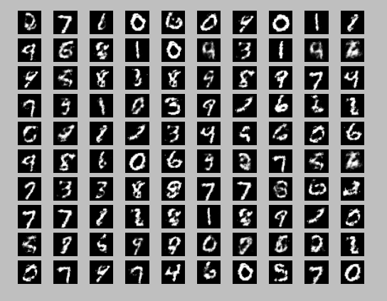

### Introduction

  A simple implementation of the [generative adversarial nets](https://arxiv.org/abs/1406.2661).
  
  Generated images:
  

### Dependencies

* [Python3.5](https://www.python.org/)
* [Numpy](http://www.numpy.org/)
* [Matplotlib](http://matplotlib.org/)
* [Tensorflow](https://www.tensorflow.org/)
